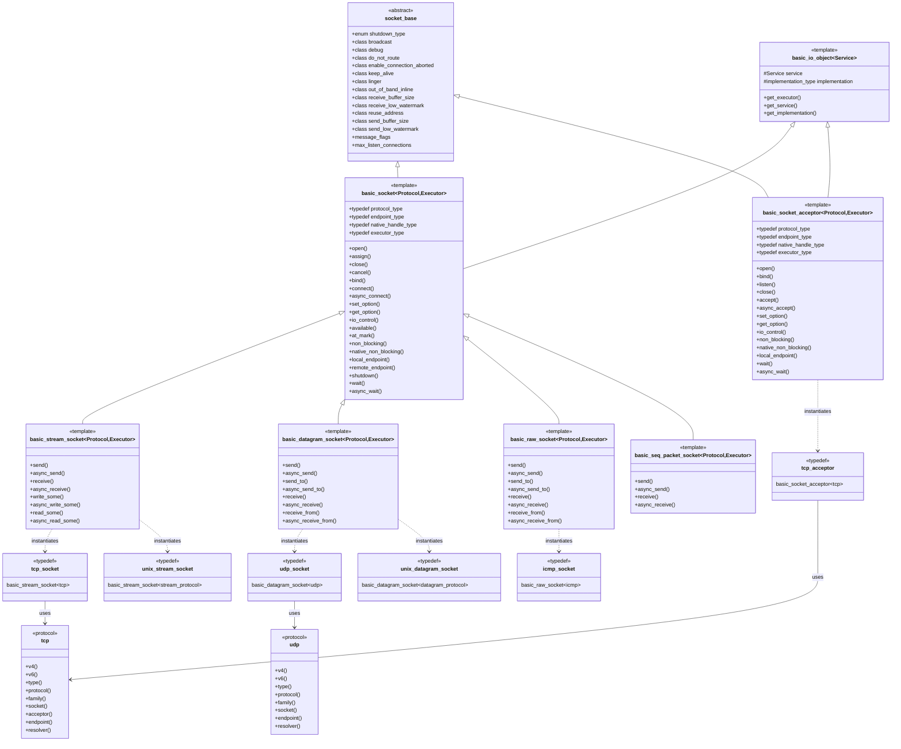

# ASIO Socket Hierarchy

This diagram illustrates the class hierarchy and relationships between ASIO's socket classes, showing how different socket types inherit from base classes and specialize for different protocols.

## Key Components Explained

### Base Classes

1. **socket_base**: The fundamental base class that defines:
   - Socket options (SO_REUSEADDR, SO_KEEPALIVE, etc.)
   - Shutdown types (receive, send, both)
   - Message flags for send/receive operations
   - Common constants like max_listen_connections

2. **basic_io_object**: Template base class that:
   - Manages the underlying I/O service implementation
   - Provides access to the executor
   - Handles the lifetime of the I/O object

### Core Socket Templates

1. **basic_socket**: The main socket template that:
   - Inherits from both socket_base and basic_io_object
   - Provides core socket operations (open, bind, connect, close)
   - Handles both synchronous and asynchronous operations
   - Manages socket options and I/O control commands
   - Provides endpoint information (local and remote)

2. **basic_stream_socket**: Specializes basic_socket for stream-oriented protocols:
   - TCP sockets
   - Unix domain stream sockets
   - Provides send/receive operations for connected sockets
   - Implements read_some/write_some for partial I/O

3. **basic_datagram_socket**: Specializes basic_socket for datagram protocols:
   - UDP sockets
   - Unix domain datagram sockets
   - Provides send_to/receive_from for connectionless communication

4. **basic_raw_socket**: For raw socket protocols:
   - ICMP sockets
   - Custom protocol implementations
   - Direct access to IP layer

5. **basic_seq_packet_socket**: For sequenced packet protocols:
   - SCTP-like protocols
   - Preserves message boundaries with reliable delivery

6. **basic_socket_acceptor**: Specialized for accepting connections:
   - Used with stream-oriented protocols
   - Provides listen and accept operations
   - Manages the server-side socket lifecycle

### Concrete Types

The diagram shows how concrete types like `tcp::socket`, `udp::socket`, etc., are typically typedef'd from the basic templates, providing convenient aliases for common use cases.

### Protocol Classes

Protocol classes (tcp, udp, etc.) define:
- Protocol-specific constants
- Factory methods for creating endpoints
- Type definitions for sockets and acceptors
- IPv4/IPv6 specific variants

This hierarchy allows ASIO to provide a consistent interface across different socket types while maintaining type safety and enabling protocol-specific optimizations.