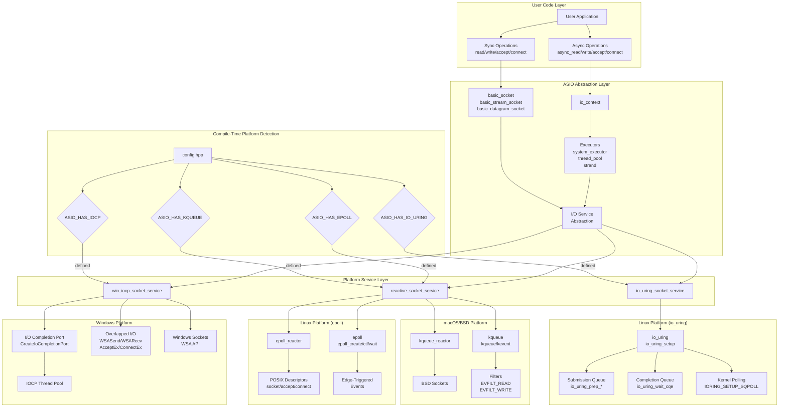

# ASIO Platform Architecture

This diagram shows how ASIO abstracts different platform-specific I/O mechanisms while providing a unified interface.



## Platform-Specific Architecture Details

### Windows - I/O Completion Ports (IOCP)

**Architecture Pattern**: Proactor
- True asynchronous I/O where the OS performs the operation
- Completion notifications delivered to completion port
- Highly scalable with automatic thread pool management

**Key Components**:
- **IOCP**: Kernel object that queues completion notifications
- **Overlapped I/O**: Asynchronous I/O operations
- **Thread Pool**: Worker threads calling `GetQueuedCompletionStatus`
- **WSA Functions**: Windows-specific socket extensions

**Advantages**:
- Zero-copy networking possible
- Excellent scalability for high connection counts
- Kernel handles thread wake-up optimization

**Implementation Details**:
```cpp
// Simplified IOCP operation flow
CreateIoCompletionPort(socket, iocp, key, 0);
WSASend(socket, buffers, ..., &overlapped);
GetQueuedCompletionStatus(iocp, &bytes, &key, &overlapped, timeout);
```

### Linux - epoll

**Architecture Pattern**: Reactor
- Edge-triggered or level-triggered event notification
- Application must perform I/O when notified
- Scales better than select/poll

**Key Components**:
- **epoll instance**: Kernel event table
- **Interest List**: Registered file descriptors
- **Ready List**: Descriptors with events
- **Edge-Triggered Mode**: More efficient but requires careful handling

**Advantages**:
- O(1) event delivery (not O(n) like select)
- Supports large numbers of connections
- Fine-grained event control

**Implementation Details**:
```cpp
// Simplified epoll operation flow
int epfd = epoll_create1(EPOLL_CLOEXEC);
epoll_ctl(epfd, EPOLL_CTL_ADD, socket, &event);
int n = epoll_wait(epfd, events, max_events, timeout);
// Perform I/O on ready sockets
```

### Linux - io_uring

**Architecture Pattern**: Proactor
- True asynchronous I/O at kernel level
- Lock-free ring buffers for submission/completion
- Supports all I/O operations, not just sockets

**Key Components**:
- **Submission Queue (SQ)**: Application submits operations
- **Completion Queue (CQ)**: Kernel posts completions
- **SQEs/CQEs**: Submission/Completion queue entries
- **Kernel Polling**: Optional kernel-side polling thread

**Advantages**:
- Minimal syscall overhead
- Batch submission/completion
- True async file I/O support
- SQPOLL for syscall-free operation

**Implementation Details**:
```cpp
// Simplified io_uring operation flow
io_uring_setup(entries, &params);
io_uring_get_sqe(&ring); // Get submission entry
io_uring_prep_read(sqe, fd, buf, len, offset);
io_uring_submit(&ring);
io_uring_wait_cqe(&ring, &cqe);
```

### macOS/BSD - kqueue

**Architecture Pattern**: Reactor
- Similar to epoll but with different semantics
- Unified interface for various event types
- Supports file, signal, timer events

**Key Components**:
- **kqueue**: Kernel event queue
- **kevent structures**: Event registration/notification
- **Filters**: EVFILT_READ, EVFILT_WRITE, etc.
- **Flags**: EV_ADD, EV_DELETE, EV_ENABLE, etc.

**Advantages**:
- Very flexible event filtering
- Supports many event types beyond I/O
- Good performance characteristics

**Implementation Details**:
```cpp
// Simplified kqueue operation flow
int kq = kqueue();
EV_SET(&change, socket, EVFILT_READ, EV_ADD, 0, 0, NULL);
kevent(kq, &change, 1, events, max_events, &timeout);
// Perform I/O on ready sockets
```

## Service Selection Logic

ASIO selects the appropriate service at compile time:

1. **Windows**: Always uses IOCP when available
2. **Linux**: 
   - Prefers io_uring if available and enabled
   - Falls back to epoll
   - Can force selection via macros
3. **macOS/BSD**: Uses kqueue
4. **Fallback**: select() for maximum portability

## Key Abstractions

### io_context
- Manages event loop
- Dispatches completion handlers
- Platform-agnostic interface

### Socket Services
- Implement platform-specific operations
- Handle async operation lifecycle
- Manage platform resources

### Executors
- Control handler execution context
- Enable custom execution strategies
- Support strand-based serialization

### Operation Objects
- Encapsulate async operation state
- Store handlers with type erasure
- Link to platform-specific structures

## Performance Considerations

**IOCP (Windows)**:
- Best for high connection count servers
- Automatic thread scaling
- Higher memory usage per connection

**epoll (Linux)**:
- Excellent for typical server loads
- Lower memory overhead
- Requires careful edge-triggered handling

**io_uring (Linux)**:
- Best for high-performance I/O
- Lowest syscall overhead
- Requires newer kernels (5.1+)

**kqueue (macOS/BSD)**:
- Good general performance
- Rich event type support
- Well-integrated with OS

This architecture allows ASIO to leverage the best features of each platform while maintaining a consistent API for portable network programming.