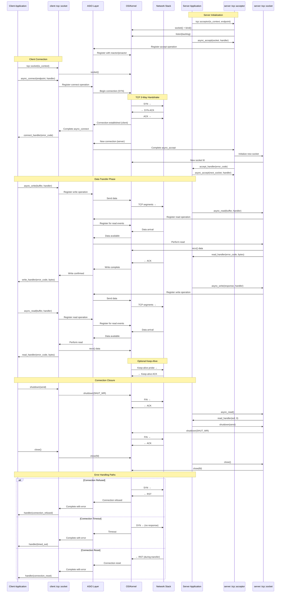

# TCP Connection Lifecycle

This sequence diagram shows the complete lifecycle of a TCP connection in ASIO, from connection establishment through data transfer to closure.



## Lifecycle Phases Explained

### 1. Server Initialization

**Socket Creation and Binding**:
```cpp
tcp::acceptor acceptor(io_context, tcp::endpoint(tcp::v4(), port));
```
- Creates a socket
- Binds to specified address and port
- Sets socket options (e.g., SO_REUSEADDR)

**Listen State**:
```cpp
acceptor.listen(backlog);
```
- Transitions socket to listening state
- Sets maximum pending connection queue size

**Accept Loop**:
```cpp
acceptor.async_accept(socket, handler);
```
- Registers for incoming connections
- Creates new socket for each connection

### 2. Client Connection

**Socket Creation**:
```cpp
tcp::socket socket(io_context);
```
- Creates unconnected socket
- Selects appropriate protocol family

**Connection Initiation**:
```cpp
socket.async_connect(endpoint, handler);
```
- Initiates TCP handshake
- Non-blocking operation

### 3. TCP Three-Way Handshake

1. **SYN**: Client sends synchronize packet
2. **SYN-ACK**: Server acknowledges and synchronizes
3. **ACK**: Client acknowledges server's SYN

This establishes:
- Initial sequence numbers
- Window sizes
- TCP options (MSS, window scaling, etc.)

### 4. Data Transfer

**Async Write Operations**:
```cpp
async_write(socket, buffer, handler);
```
- May require multiple send() calls
- Handles partial writes automatically
- Completion handler called when all data sent

**Async Read Operations**:
```cpp
async_read(socket, buffer, handler);
```
- Reads until buffer full or error
- Handles partial reads
- Various read functions available:
  - `async_read_some()`: Partial reads
  - `async_read_until()`: Read until delimiter
  - `async_read()`: Read exact amount

**Flow Control**:
- TCP window management
- Nagle's algorithm (can be disabled)
- Kernel buffer management

### 5. Connection Closure

**Graceful Shutdown**:
```cpp
socket.shutdown(tcp::socket::shutdown_send);
```
- Sends FIN packet
- Half-close: can still receive
- Full-close: shutdown both directions

**Socket Close**:
```cpp
socket.close();
```
- Releases all resources
- Immediate termination
- Any pending data may be lost

### 6. Error Handling

**Common Errors**:
- `connection_refused`: No listener on port
- `connection_reset`: RST packet received
- `timed_out`: Connection attempt timeout
- `broken_pipe`: Write to closed connection
- `eof`: Graceful closure by peer

## Important Considerations

### Socket Options

Common options set during lifecycle:
```cpp
socket.set_option(tcp::no_delay(true));        // Disable Nagle
socket.set_option(socket_base::keep_alive(true)); // Enable keep-alive
socket.set_option(socket_base::reuse_address(true)); // Allow reuse
```

### Timeouts

ASIO doesn't have built-in socket timeouts. Implement using:
```cpp
deadline_timer timer(io_context);
timer.expires_from_now(seconds(30));
timer.async_wait([&](error_code ec) {
    if (!ec) socket.cancel();
});
```

### Connection Pooling

For client applications:
- Reuse connections when possible
- Implement connection pool with idle timeout
- Handle connection failures gracefully

### Server Scalability

- Accept loop should always be running
- Handle multiple concurrent connections
- Consider using `SO_REUSEPORT` on Linux
- Use appropriate executor/thread pool

### SSL/TLS Considerations

When using SSL:
```cpp
ssl::stream<tcp::socket> socket(io_context, ssl_context);
// Perform TCP connect first
// Then SSL handshake
socket.async_handshake(ssl::stream_base::client, handler);
```

This lifecycle diagram illustrates the complete flow from connection establishment to termination, including error scenarios and best practices for robust TCP communication using ASIO.